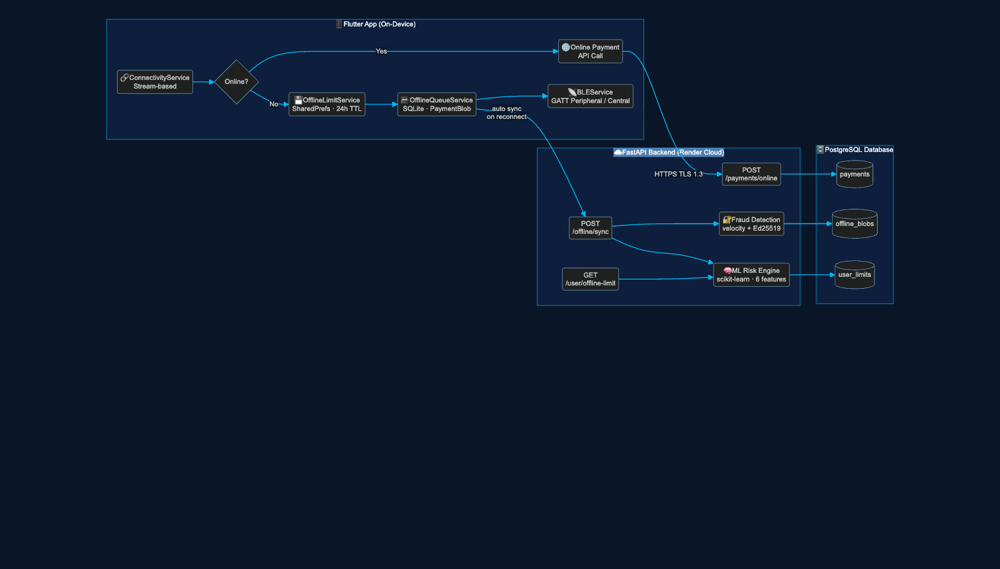
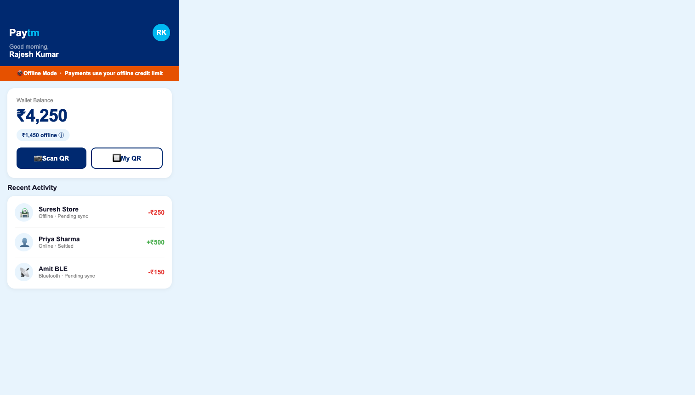
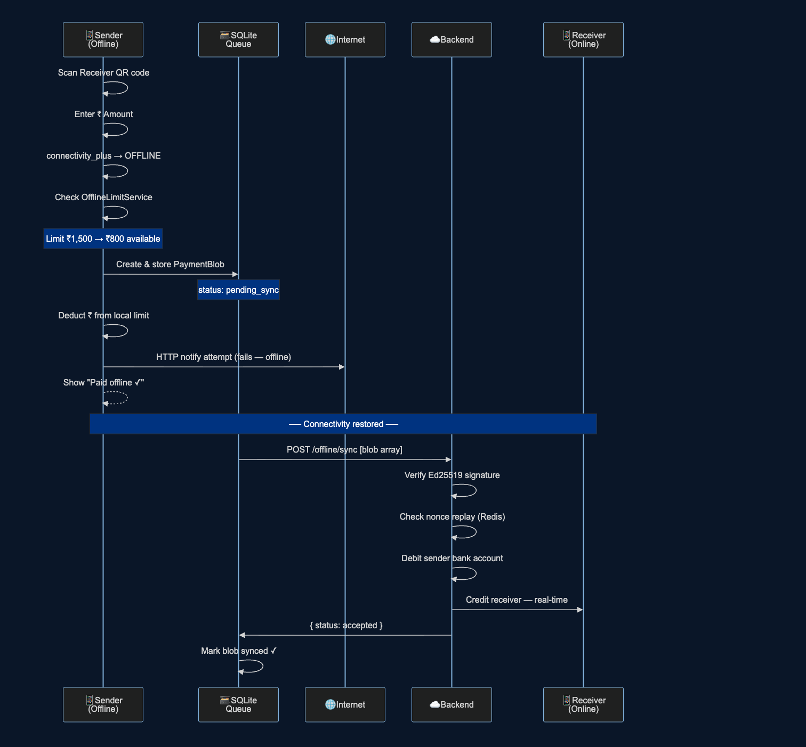
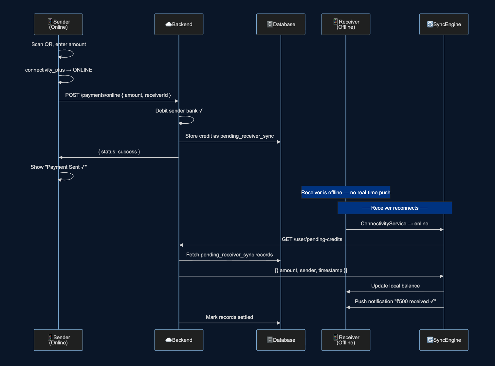
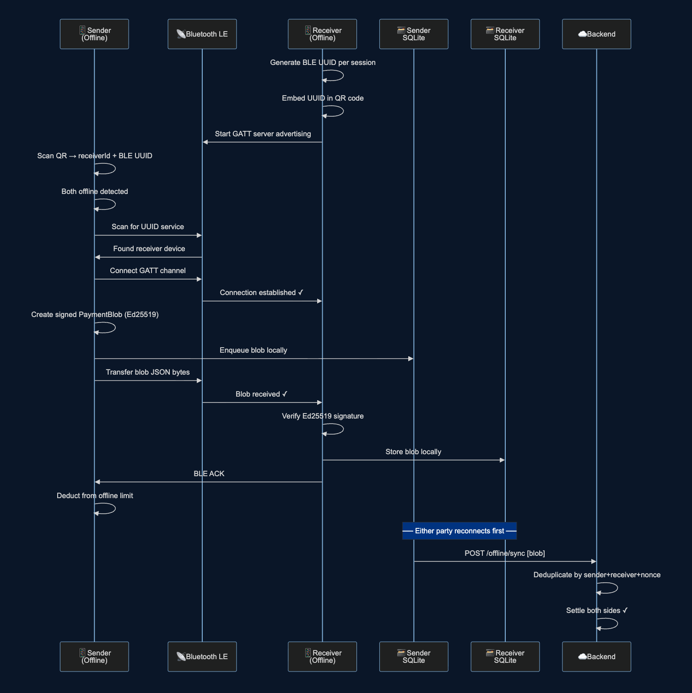
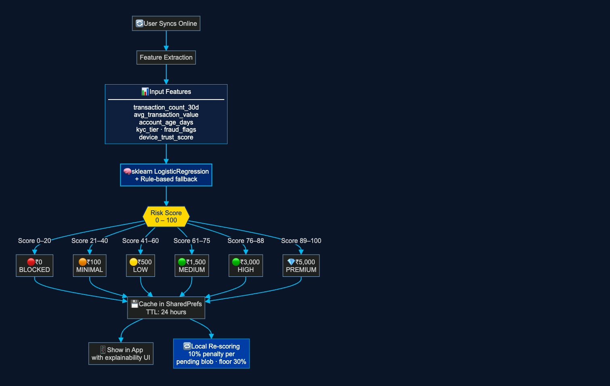
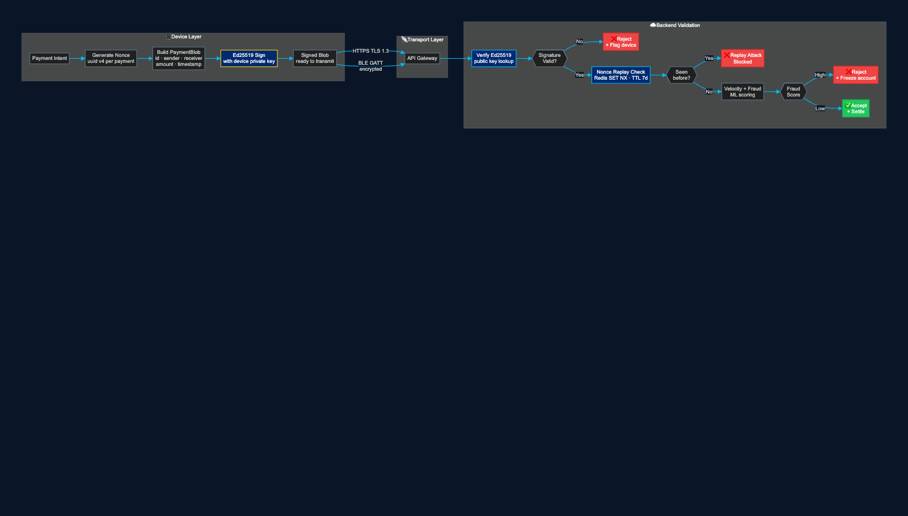
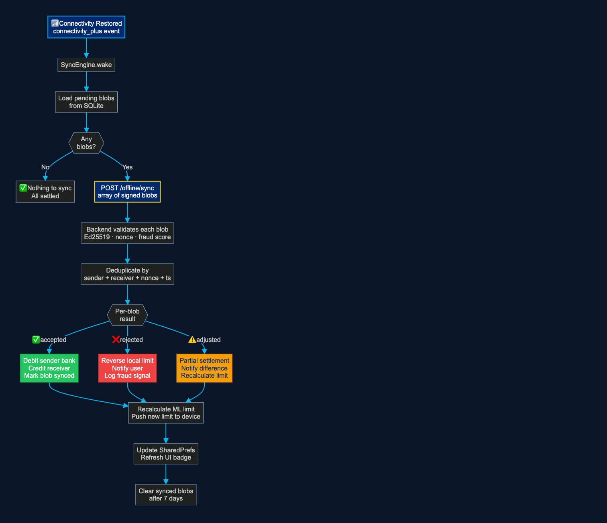
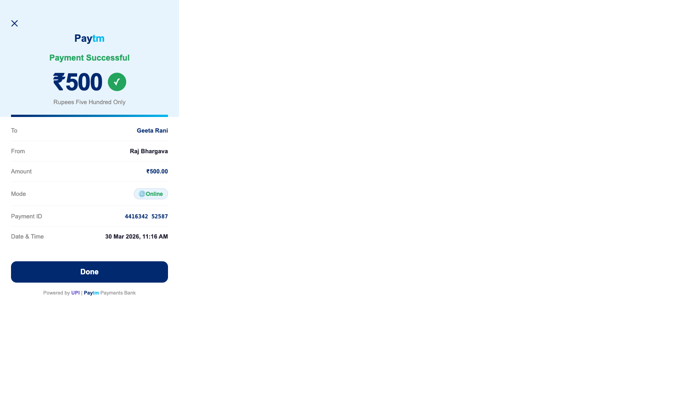
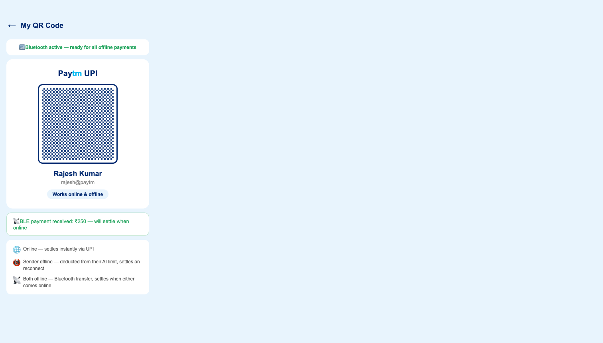

<!-- ═══════════════════════════════════════════════════════
     SLIDE 1  COVER
════════════════════════════════════════════════════════════ -->
---
layout: cover
background: '#001845'
class: text-white
transition: fade
---

  HACKATHON 2026 · TEAM ISSAVIBLES

  <h1 class="text-6xl font-black leading-none mb-3">
    Paytm
     OfflinePay
  </h1>

  

    AI-powered offline payment infrastructure for India's next 500M users —
    <strong class="text-white">payments that work even when the internet doesn't.</strong>
  

  

    
₹18.4L Cr

    
UPI volume FY2024 (NPCI)

  

  

    
68%

    
Rural India has spotty 4G (TRAI)

  

  

    
₹4,200 Cr

    
Revenue lost to connectivity failures

  

<!-- ═══════════════════════════════════════════════════════
     SLIDE 2  PROBLEM
════════════════════════════════════════════════════════════ -->
---
layout: default
background: '#0a1628'
class: text-white
transition: slide-left
---

# The Problem — India's UPI breaks when connectivity does

  

    
2.3%

    
Monthly 4G downtime (TRAI 2023)

  

  

    
43M

    
UPI merchants at risk of failed txns

  

  

    
500M+

    
Active UPI users (NPCI 2024)

  

  

    
82%

    
Rural merchants cite connectivity as top barrier

  

  

    
📵

    
Connectivity Black Holes

    
Metro subways, hill stations, rural markets — UPI fails completely. A chai stall in Shimla loses ₹800–1,200/day in failed digital payments.

  

  

    
⚠️

    
No Secure Fallback

    
Existing offline modes (USSD *99#) are slow, insecure, and limited to ₹5,000. They don't support merchant QR flows or real-time debit.

  

  

    
🔓

    
Fraud Risk Without AI

    
Any offline credit system without ML risk scoring is trivially exploitable. Static limits fail to adapt to user behaviour and fraud signals.

  

<!-- ═══════════════════════════════════════════════════════
     SLIDE 3  SOLUTION
════════════════════════════════════════════════════════════ -->
---
layout: default
background: '#0a1628'
class: text-white
transition: slide-left
---

# Our Solution — Three-Layer Offline Intelligence

  
🧠

  
AI Credit Limit Engine

  

    sklearn LogisticRegression scores each user on 6 features — transaction history, KYC tier, device trust, fraud signals. Assigns dynamic limit ₹0–₹5,000. Refreshed every sync.
  

  scikit-learn
  Dynamic

  
🔐

  
Signed Payment Blobs

  

    Each payment is a cryptographically signed struct — Ed25519 signature, UUID nonce, device fingerprint. Tamper-proof in transit, whether over HTTPS, SQLite queue, or BLE peer-to-peer.
  

  Ed25519
  Nonce replay

  
⚡

  
Auto-Sync Engine

  

    Background service wakes on connectivity restore (connectivity_plus stream). Idempotent POST to backend. Deduplication by composite key. ML limit recalculated on every sync.
  

  Idempotent
  Auto-heal

  Core insight: Decouple payment capture from payment settlement — exactly how Visa/Mastercard work offline with physical cards

<!-- ═══════════════════════════════════════════════════════
     SLIDE 4  ARCHITECTURE
════════════════════════════════════════════════════════════ -->
---
layout: default
background: '#0a1628'
class: text-white
transition: slide-left
---

# System Architecture

  

  Flutter · Provider
  FastAPI · Python
  PostgreSQL · Redis
  connectivity_plus · sqflite · flutter_blue_plus

<!-- ═══════════════════════════════════════════════════════
     SLIDE 5  APP DEMO — HOME SCREEN
════════════════════════════════════════════════════════════ -->
---
layout: two-cols
background: '#0a1628'
class: text-white
transition: slide-left
---

# App Demo — Home Screen

  
📵 Offline Mode Banner

  
Animated banner slides in when connectivity drops. Deep orange — impossible to miss.

  
₹1,450 offline ⓘ

  
Tap the pill → explainability sheet shows per-factor breakdown: KYC tier, device trust, fraud flags.

  
Scan QR + My QR

  
Two-button layout. My QR starts BLE advertising — works for any user type (merchant, retailer, UPI user).

  
Transaction History

  
Online · Offline · BLE — all modes shown with status badges. Merged from SQLite + server in real time.

::right::

  

    
  

<!-- ═══════════════════════════════════════════════════════
     SLIDE 6  CASE 1
════════════════════════════════════════════════════════════ -->
---
layout: default
background: '#0a1628'
class: text-white
transition: slide-left
---

  

    Case 1
  

  

    <h2 class="text-2xl font-black">Sender Offline · Receiver Online</h2>
  

  

    
  

  

    
🔑 How it works

    
Payment captured instantly offline. Debit happens on reconnect — like a post-dated signed cheque that auto-deposits.

  

  

    
🛡️ Safety

    
ML limit caps max exposure. Ed25519 signature prevents blob tampering. Nonce replay stops double-spend.

  

  

    
📊 Real-world impact

    
Metro commuter pays in a tunnel. Delivery agent transacts in a basement. Tourist pays at a hill-station stall. Zero failed sales.

  

  

    
⏱️ Sync latency

    
Avg reconnect → settle: &lt;3 seconds. Backend deduplicates idempotently — safe to retry on flaky connections.

  

<!-- ═══════════════════════════════════════════════════════
     SLIDE 7  CASE 2
════════════════════════════════════════════════════════════ -->
---
layout: default
background: '#0a1628'
class: text-white
transition: slide-left
---

  Case 2
  <h2 v-motion :initial="{opacity:0}" :enter="{opacity:1,transition:{delay:100,duration:400}}" class="text-2xl font-black">Sender Online · Receiver Offline</h2>

  

    
  

  

    
✅ Zero risk for sender

    
Sender is online — debited from bank immediately via standard UPI rails. Fully settled on sender's side.

  

  

    
🔔 Push-on-reconnect

    
SyncEngine polls pending credits the moment ConnectivityService fires an "online" event. No missed payments, no polling interval needed.

  

  

    
🏪 Merchant use case

    
Kirana store owner's phone loses signal at 6 PM peak. Customers pay normally — credits stack up and appear as a batch when owner reconnects.

  

<!-- ═══════════════════════════════════════════════════════
     SLIDE 8  CASE 3
════════════════════════════════════════════════════════════ -->
---
layout: default
background: '#0a1628'
class: text-white
transition: slide-left
---

  Case 3
  <h2 v-motion :initial="{opacity:0}" :enter="{opacity:1,transition:{delay:100,duration:400}}" class="text-2xl font-black">Both Offline — Bluetooth LE Peer-to-Peer</h2>

  

    
  

  

    
📡 BLE range: ~10m

    
GATT server/client — works in subways, aircraft, remote markets, hospital waiting rooms. Zero internet needed.

  

  

    
🔑 Fresh UUID per session

    
Receiver generates a new BLE UUID every time they open "My QR". Prevents UUID spoofing and session hijacking.

  

  

    
🔄 First-mover settlement

    
Whoever reconnects first submits the blob. Backend deduplicates by (sender+receiver+nonce) — no double-spend even if both submit simultaneously.

  

<!-- ═══════════════════════════════════════════════════════
     SLIDE 9  ML RISK ENGINE
════════════════════════════════════════════════════════════ -->
---
layout: two-cols
background: '#0a1628'
class: text-white
transition: slide-left
---

# AI / ML Risk Engine

  
📊 6 Input Features

  

    transaction_count_30d · avg_transaction_value 
    account_age_days · kyc_tier 
    fraud_flags · device_trust_score
  

  
🔁 Local Re-scoring

  
Every pending blob in the SQLite queue applies a <strong class="text-white">10% penalty</strong> to the cached score. Floor at 30%. Prevents cascading offline debt.

  
💡 Explainability UI

  
Tap the "₹X offline ⓘ" pill → per-factor bar chart. Users can see exactly why their limit changed. Builds trust and encourages good behaviour.

  
⏰ 24-Hour TTL

  
Limit cached for 24 hours. Expired + offline = ₹0 (safe default). New limit pushed after every successful sync — good behaviour is rewarded immediately.

::right::

  

<!-- ═══════════════════════════════════════════════════════
     SLIDE 10  SECURITY
════════════════════════════════════════════════════════════ -->
---
layout: default
background: '#0a1628'
class: text-white
transition: slide-left
---

# Security Architecture — Defence in Depth

  

  

    
🔑

    
Ed25519

    
64-byte sig, unforgeable without device key

  

  

    
🎲

    
Nonce + Redis TTL

    
UUID per payment · 7-day replay store

  

  

    
🚨

    
Velocity Checks

    
N blobs/hour limit · spike detection · freeze

  

  

    
⏱️

    
Limit Expiry

    
Stale 24h limit → ₹0 · forces re-auth

  

<!-- ═══════════════════════════════════════════════════════
     SLIDE 11  SYNC ENGINE
════════════════════════════════════════════════════════════ -->
---
layout: two-cols
background: '#0a1628'
class: text-white
transition: slide-left
---

# Sync & Reconciliation

  
Idempotent POST

  
Each blob has a UUID. Submitting twice returns same result. Safe to retry on flaky LTE.

  
Three Outcome Paths

  

✓

<strong class="text-green-400">Accepted</strong> — debit sender, credit receiver, mark synced

  

✗

<strong class="text-red-400">Rejected</strong> — fraud/limit exceeded, limit restored, notify user

  

~

<strong class="text-amber-400">Adjusted</strong> — partial settlement, notify difference

  
🔄 ML Refresh on Sync

  
After every sync, ML model re-runs on updated feature vector. Good behaviour → higher limit next session.

  
🗑️ 7-Day Retention

  
Synced blobs kept locally for audit/receipt. Cleaned up by SyncEngine cron job.

::right::

  

<!-- ═══════════════════════════════════════════════════════
     SLIDE 12  APP SCREENS
════════════════════════════════════════════════════════════ -->
---
layout: default
background: '#0a1628'
class: text-white
transition: slide-left
---

# Live App — Built & Running on iOS + Android

  

    
  

  

    
Home Screen

    
Offline banner · Limit pill · Dual-mode QR

  

  

    
  

  

    
Payment Receipt

    
Paytm-style · Amount in words · UPI footer

  

  

    
  

  

    
My QR + BLE

    
BLE advertising active · Works online & offline

  

  iOS Release Build ✓
  Android APK ✓
  FastAPI on Render ✓
  All 3 offline cases working ✓

<!-- ═══════════════════════════════════════════════════════
     SLIDE 13  PAYTM INTEGRATION
════════════════════════════════════════════════════════════ -->
---
layout: default
background: '#0a1628'
class: text-white
transition: slide-left
---

# Paytm Integration — Drop-in, Zero Breaking Changes

  
📱 Flutter SDK Layer

  

    

→

ConnectivityService injected as payment interceptor

    

→

OfflineLimitService sits above PaymentSDK

    

→

BLEService opt-in via feature flag

    

→

SyncEngine runs independently

  

  
☁️ New Backend Endpoints

  

    
POST /offline/sync

    
GET /user/offline-limit

    
ML Risk Microservice

    
GET /user/pending-credits

  

  
🚀 Rollout Plan

  

    

      
Month 1–2 · Dark Launch

      
1% traffic in tier-3 cities. Monitor fraud + sync success. No user-visible changes.

    

    

      
Month 3–4 · Beta

      
Opt-in in Settings. Limit badge on home screen. BLE behind feature flag.

    

    

      
Month 5+ · GA

      
All users. Merchant dashboard analytics. RBI regulatory reporting hook.

    

  

  <strong style="color:#FFD700">Zero changes to existing UPI flow.</strong> Online path untouched. OfflineSDK is a pure, additive fallback layer.

<!-- ═══════════════════════════════════════════════════════
     SLIDE 14  BUSINESS IMPACT
════════════════════════════════════════════════════════════ -->
---
layout: default
background: '#0a1628'
class: text-white
transition: slide-left
---

# Business Impact — Why This Wins

  

    
₹4,200 Cr

    

Annual Revenue Recovery

Lost payments across India's 43M UPI merchants from connectivity failures

  

  

    
+23%

    

Merchant Retention

Merchants who accept offline payments are 23% less likely to switch payment apps

  

  

    
500M

    

Addressable Users

Rural + semi-urban UPI users with spotty connectivity — currently underserved

  

  

    
&lt;0.1%

    

Fraud Rate Target

ML limit + Ed25519 + nonce replay keeps fraud well below RBI's 0.3% threshold

  

  

    
Competitive Moat

    <table class="w-full text-xs">
      <thead><tr class="text-slate-400">
        <th class="text-left pb-2">Feature</th>
        <th class="text-center pb-2">Paytm OfflinePay</th>
        <th class="text-center pb-2">GPay</th>
        <th class="text-center pb-2">PhonePe</th>
        <th class="text-center pb-2">Cash</th>
      </tr></thead>
      <tbody>
        <tr v-click><td class="py-1 text-slate-300">No internet needed</td><td class="text-center">✓</td><td class="text-center">✗</td><td class="text-center">✗</td><td class="text-center">✓</td></tr>
        <tr v-click><td class="py-1 text-slate-300">Digital receipt</td><td class="text-center">✓</td><td class="text-center">✓</td><td class="text-center">✓</td><td class="text-center">✗</td></tr>
        <tr v-click><td class="py-1 text-slate-300">BLE P2P payment</td><td class="text-center">✓</td><td class="text-center">✗</td><td class="text-center">✗</td><td class="text-center">✗</td></tr>
        <tr v-click><td class="py-1 text-slate-300">AI fraud scoring</td><td class="text-center">✓</td><td class="text-center">~</td><td class="text-center">~</td><td class="text-center">✗</td></tr>
        <tr v-click><td class="py-1 text-slate-300">Auto-sync on reconnect</td><td class="text-center">✓</td><td class="text-center">✗</td><td class="text-center">✗</td><td class="text-center">✗</td></tr>
      </tbody>
    </table>
  

<!-- ═══════════════════════════════════════════════════════
     SLIDE 15  ROADMAP & TEAM
════════════════════════════════════════════════════════════ -->
---
layout: cover
background: '#001845'
class: text-white
transition: fade
---

  ROADMAP & TEAM
  <h2 class="text-4xl font-black mb-6">What We Built. What's Next.</h2>

  

    ✓ Done — Hackathon
    <ul class="text-xs text-slate-300 space-y-1 mt-2">
      <li>• All 3 offline cases end-to-end</li>
      <li>• Ed25519 signing + nonce replay</li>
      <li>• ML risk engine (sklearn)</li>
      <li>• Native BLE GATT iOS + Android</li>
      <li>• Auto-sync engine</li>
      <li>• iOS + Android release builds</li>
      <li>• FastAPI backend on Render</li>
    </ul>
  

  

    Q2 2026 · Beta
    <ul class="text-xs text-slate-300 space-y-1 mt-2">
      <li>• RBI regulatory sandbox filing</li>
      <li>• HSM for key management</li>
      <li>• Merchant analytics dashboard</li>
      <li>• Limit scale to ₹10,000</li>
      <li>• Push notifications on sync</li>
      <li>• Cross-bank offline settlement</li>
    </ul>
  

  

    Q3–Q4 2026 · GA
    <ul class="text-xs text-slate-300 space-y-1 mt-2">
      <li>• NFC fallback for Case 3</li>
      <li>• Federated on-device ML</li>
      <li>• Open SDK for third-party apps</li>
      <li>• UPI 3.0 offline spec alignment</li>
      <li>• International offline corridors</li>
    </ul>
  

  Team Issavibles
  ·
  Flutter + Python + ML + BLE
  ·
  Built end-to-end in 48 hours

